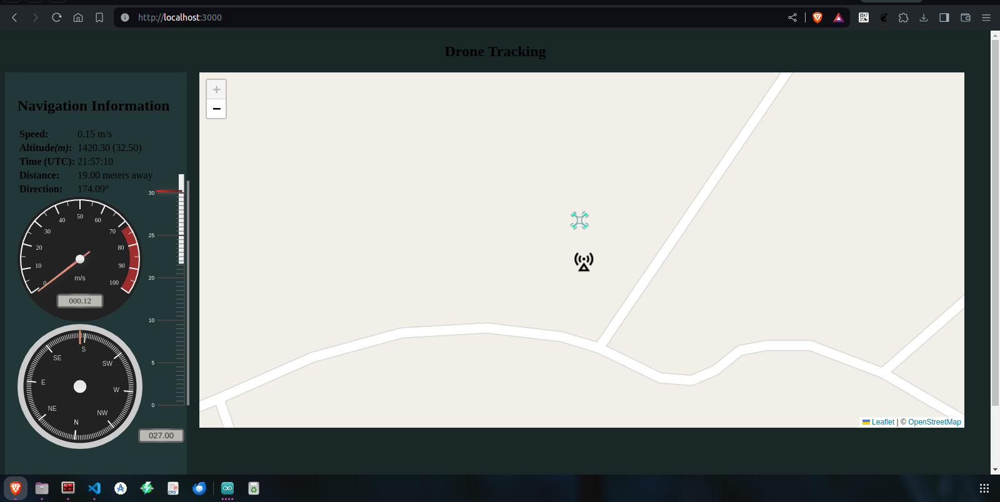

# Tack Drone

A minimalistic visualization dashboard for a drone in flight.

## Setup

Clone [this](https://www.github.com/jetsup/track-drone) repository and install all the dependencies

```bash
git clone https://www.github.com/jetsup/track-drone.git
cd track-drone
cp config.example.js config.js # remember to edit this file accordingly
npm install
```

```bash
# For windows users
COPY config.example.js config.js # remember to edit this file accordingly
```

Connect the base control module and edit the `config.js` file that will have been created from the [config.example.js](./config.example.js)


_Test flight demo :)_
